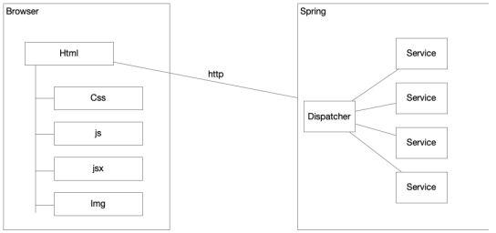
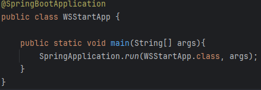
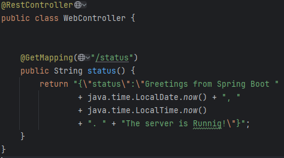
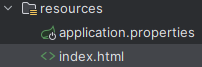
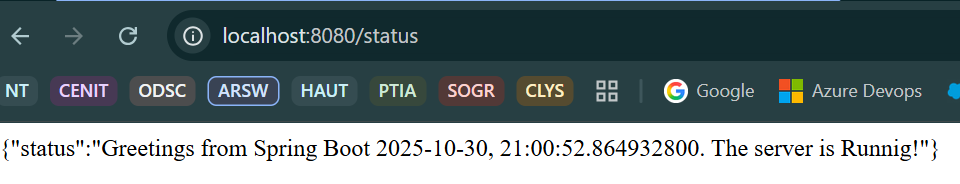
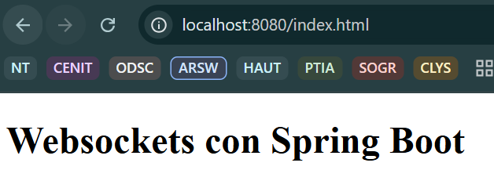

# Arquitecturas de Software (ARSW) - Laboratorio #7

## Spring, Websockets y ReactJS.

#### Nicolás Toro

[](https://www.oracle.com/java/)
[](https://maven.apache.org/)

---

Vamos ahora a realizar un tutorial para implementar una aplicación pequeña que implementa
un a aplicación Web que utiliza Web Sockets.

## Arquitectura

Queremos construir una aplicación web con comunicación bidirectional entre el cliente y el
servidor. El servidor hace un broadcast de un mensaje cada 5 segundos a todos los clientes
conectados. Para realizarlo utilizaremos:

* Spring como servidor web y de aplicaciones,
* El browser con Js y ReactJs como cliente pesado
* Y WebSockets para establecer la conexión bidirectional



### Conceptos de Spring

Recuerde que spring implementa un framework de IoC con inyección de dependencias. El
objetivo de este tipo de framework ha sido el facilitar el desarrollo de aplicaciones
empresariales, disminuyendo el riesgo de errores y aumentando la eficiencia. Por esto, Spring
provee una serie de librerías y un entorno de ejecución que proponen un modelo de
programación por componentes.

La idea detrás de esto es que los desarrolladores deben preocuparse por construir
componentes con responsabilidades concretas de negocio, y el framework se preocupa por
proveer de manera transparente características como:

* Seguridad
* Concurrencia
* Distribución-comunicación
* Soporte multiusuario
* Persistencia
* Tolerancia a fallos
* Escalabilidad

En este contexto el programador provee objetos de negocio y la interfaz gráfica, y el
framework IoC se encarga de orquestarlos en una aplicación robusta.

En este contexto los programadores pierden un poco de flexibilidad, pero pueden ganar en
tiempo de entrega, calidad, escalabilidad y mantenibilidad.

Sin embargo, recuerde que todo esto se ejecuta sobre una máquina virtual, por lo tanto, tiene
todo el poder de esta a su alcance.

### Arquitectura basada en anotaciones

Las anotaciones son el mecanismo usado para comunicar la intención de un componente
dentro del framework. El tipo de componente determina el comportamiento y el ciclo de vida
que le otorga el framework. Así, el programador crea un conjunto de componentes, les asigna
unas responsabilidades y el framework orquesta la aplicación.

Vamos a revisar algunas de las anotaciones y sus roles respectivos

@Inject (Java Standard), @Autowire (Spring specific). Inyecta componentes por tipo. En un
campo inyecta le componente correspondiente, en un constructor llama al constructor con
los parámetros correspondientes, y en un setter llama al setter con los parámetros
correspondientes. (@Resource es similar, pero busca primero por nombre).

```bash
class Car {
 @Inject
 Engine engine;
}
```

@Bean. Marca un método factory que instancia beans de spring. Es llamado cuando se
require un Bean de ese tipo

```bash

@Bean
Engine engine() {
return new Engine();
}
```

@Scope. Define el alcance de un @Componente o @Bean. Puede ser singleton, prototype,
request, session, globalSession o un alcance personalizado. El siguiente ejemplo define un
singleton para todo el entorno IoC.

```bash

@Component
@Scope(“singleton")
class Engine {}
```

@Component. Marca una clase que se escanea al iniciar Spring y se utiliza para definir un
bean. Si no tiene scope por defecto será singleton. En general los componentes deben ser
“sin estado”, es decir stateless.

@Repository. Es usado para marcar el acceso a una base de datos, es también un
componente escaneado al principio.

@Service. Un servicio de negocio,, es también un componente escaneado al principio.

Su habilidad para manejar la plataforma dependerá mucho de su conocimiento de los efectos
de las anotaciones. Le recomiendo revisar en detalle estás responsabilidades:
* Spring Core Annotations
* Spring Web Annotations
* Spring Boot Annotations
* Spring Scheduling Annotations
* Spring Data Annotations
* Spring Bean Annotations

### Modelo Vista Controlador

Cuando programamos una aplicación WEB generalmente pensamos en el patron de modelo
vista controlador. En este patron el controlador controla el flujo de los mensajes, el modelo
tiene el modelo de negocio y la vista presenta los resultados. Para entender el modelo y
cómo funciona en spring podemos referirnos a la arquitectura de Dispatcher servlet. Esta
arquitectura implementa el patrón Front Controller y se puede ever en la siguiente figura


### WebSockets
Vamos ahora a hablar un poco de los websockets. La API de WebSocket permite abrir un
canal de comunicación interactiva bidireccional entre el navegador del usuario y un servidor.
Con esta API, puede enviar mensajes a un servidor y recibir respuestas controladas por
eventos sin tener que sondear al servidor para obtener una respuesta. Es decir ya no
programa con el modelo de solicitudes siempre realizadas por el browser.

WebSocket es funcionalmente similar a los sockets estándar de estilo Unix, pero no están
técnicamente relacionados.

## Vamos ahora a construir nuestro ejemplo.

### Cree la estructura básica del proyecto.

Como siempre debemos partir de una aplicación java básica construida con Maven a la que
le agregamos la dependencia web de Spring Boot.

Para crear su ambiente de trabajo vamos a utilizar un controlador simple de Spring que nos
garantice que suba el servidor web y que empiece a servir código estático. Para esto debe:

1. Se crea con [Spring Initializr](https://start.spring.io/) utilizando Maven, Java, Spring Boot 3.5.7
y en group se pone: edu.eci.arsw
en Artifact se pone el título de la entrega. Se descarga y se ubica adecuadamente.

2. Actualizar el pom para utilizar la configuración web-MVC de spring boot. Incluya lo
   siguiente en su pom.

```bash
   <dependencies>
   <dependency>
   <groupId>org.springframework.boot</groupId>
   <artifactId>spring-boot-starter-web</artifactId>
   <version>2.3.1.RELEASE</version>
   </dependency>
   </dependencies>
```
3. Cree la siguiente clase que iniciará el servidor de aplicaciones de Spring .
   package co.edu.escuelaing.websocketsprimer;

Se crea la clase que iniciará el servidor de aplicaciones Spring.
```bash
@SpringBootApplication
public class WSStartApp {

public static void main(String[] args){
SpringApplication.run(WSStartApp.class, args);
}
}
```



4. Cree un controlador Web que le permitirá cargar la configuración mínima Web-MVC

```bash
package co.edu.escuelaing.websocketsprimer;
import org.springframework.web.bind.annotation.GetMapping;
import org.springframework.web.bind.annotation.RestController;
@RestController
public class WebController {

@GetMapping("/status")
public String status() {
return "{\"status\":\"Greetings from Spring Boot "
+ java.time.LocalDate.now() + ", "
+ java.time.LocalTime.now()
+ ". " + "The server is Runnig!\"}";
  }

}
```



4. Cree un index html en la siguiente localización: /src/main/resources/static

Debe existir un index.html para que se pueda ver la información adecuadamente.
Spring Boot busca automáticamente archivos estáticos en:

```` bash
src/main/resources/static/
````



5. Corra la clase que acabamos de crear y su servidor debe iniciar la ejecución.
6. Verifique que se esté ejecutando accediendo a:

```` bash
localhost:8080/status
````

¡¡¡ Borrar el caché del navegador !!!



7. Verifique que el servidor esté entregando elementos estáticos web entrando a:

```` bash
localhost8080:/index.html
````

Con esto se verifica la información del index.html

Diferencias entre las rutas:

* localhost8080:/ -> Busca automáticamente el index.html como página principal.
* localhost8080:/index.html -> Busca la ruta especificada.
* localhost8080:/status -> Llama al método status del controlador WebController.



**Nota:** Spring una vez arranca los servicios Web empieza a servir recursos estáticos web que
se encuentran en:
* /META-INF/resources/
* /resources/
* /static/
* /public/

**Nota 2:** Usted puede cambiar estos componentes estáticos de manera dinámica y el servidor
los actualizará sin necesidad de reiniciarlos.

### Construyamos el EndPoint el servidor con Websockets

El código de este tutorial está inspirado y adaptado del ejemplo encontrado
en. https://docs.oracle.com/javaee/7/tutorial/websocket.htm

Esta clase, ubicada en un package endpoint, se utiliza para la que muchos clientes se puedan conectar al servidor y recibir mensajes en tiempo real.

Se utiliza javax.websocket en el código dado. Esta es la API estándar de Java para WebSocket.

Pero también se puede utilizar @EnableWebSocket que pertenece a Spring y es una forma de habilitar y configurar soporte 
de WebSocket dentro del ecosistema Spring.

En este apartado vamos a utilizar javax.websocket.

No se especifica, pero se debe agregar la siguiente dependencia:

```bash
<dependency>
  <groupId>javax.websocket</groupId>
  <artifactId>javax.websocket-api</artifactId>
  <version>1.1</version>
  <scope>provided</scope>
</dependency>
```

**Nota:** Al agregar esto, tuve que eliminar el target y cerrar IntelliJ.

Se agrega el código de TimerEndpoint. (Mirar el código documentado)

### Construyamos una clase que emita mensajes desde el servidor

Se agrega el código dado para TimedMessageBroker.

En pocas palabras es una clase que gestiona (broker) el envío de mensajes utilizando el endpoint creado.
(Mirar código con documentación)

### Ahora construyamos un componente que nos ayude a configurar el contenedor IoC

Es necesario construir esta clase porque el contenedor de Servlets en Spring, TOMCAT,
tiene deshabilitado por defecto la detección de componentes Endpoints. Así, no carga los
componentes si no se le indica explícitamente. Esto parece un error de diseño, pero por el
momento esta es la situación.

La clase ServerEndpointExporter detecta beans de tipo ServerEndpointConfig y los registra
con el motor standard de java de webSockets. También detecta beans anotados con
ServerEndpoint y los registra igualmente.

Esto habilita el soporte de WebSockets y tareas programadas. (Mirar código documentado)

### Ahora construimos el cliente Web

El index.html sería:

Se modificó el index.html por el dado.

**NOTA:** Tuve que cambiar el spring-boot-starter-parent a una versión 2.7.18 para que sea compatible con javax.websockets
Verificar bien el pom.xml
